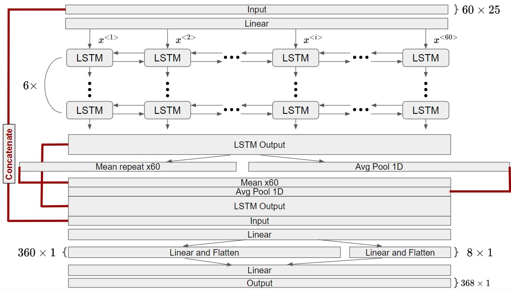

# leap-climsim-kaggle-5th

This repo contains the full solution used for the LEAP - Atmospheric Physics using AI competition, where it achieved 5th place.

The solution was created by a team consisting of [Yusef Al-Naher](https://github.com/YusefAN), [Marec Serlin](https://github.com/mserlin), [Um Hyobum](https://www.kaggle.com/ajobseeker) and [Lin Zhu](https://github.com/linzhu123455). 

## Table of Contents
- [Introduction](#introduction)
- [Preprocessing](#preprocessing)
- [Models](#models)
- [Training](#training)

## Introduction
This repository provides the code and resources for the 5th place solution for the LEAP - Atmospheric Physics using AI competition.

We achieved our results by training an ensemble of models, each with its own unique variations. The core of each model architecture is a bidirectional LSTM, with different surrounding layers and engineered features. These variations, detailed below, enabled our models to ensemble effectively, leading to our competitive score and 5th-place finish.

Our training strategy involved using as much data as possible. Some models were trained on the [ClimSim_low-res](https://huggingface.co/datasets/LEAP/ClimSim_low-res) dataset combined with the [ClimSim_low-res_aqua-planet](https://huggingface.co/datasets/LEAP/ClimSim_low-res_aqua-planet) dataset, while others used the [ClimSim_low-res](https://huggingface.co/datasets/LEAP/ClimSim_low-res) dataset combined with a subset of [ClimSim_high-res](https://huggingface.co/datasets/LEAP/ClimSim_high-res) data.

## Preprocessing

### Low-Res-Aqua-Mixed

The 556 element inputs were separated into column inputs (60x9 = 540) and global inputs (1x16). The global inputs were then repeated 60 times and concatenated to the columns to form a (60x25) input to our models. Engineered features, described in the individual model sections, are added as additional columns. All inputs and outputs, including engineered features, were standardized using their mean and standard deviation without any additional transformations.

The preprocessing steps involve parsing the raw data from the LEAP data repositories, using the script provided in the main ClimSim repository, into parquet files corresponding to the folder name. The parquet files were uploaded as Kaggle datasets. The full low-res and aqua-planet datasets were used. The preprocessing steps involve parsing the raw data from the LEAP data repositories, using the [script](https://github.com/leap-stc/ClimSim/blob/main/for_kaggle_users.py) provided in the main ClimSim repository, into parquet files corresponding to the folder name. The parquet files were uploaded as Kaggle datasets.

### Low-Res-High-Res-Mixed 

As for the previous model, the 556 element inputs are separated into column inputs (60x9 = 540) and global inputs (1x16). The global inputs are repeated 60 times and concatenated to the columns to form a (60x25) input. These models did not use any engineered features. The inputs 'state-\_q0001', 'state\_q0002', 'state\_q0003', 'pbuf\_ozone', 'pbuf\_CH4', 'pbuf\_N2O' were log-transformed. Then, all the inputs (both transformed and not) were standardized using their mean and standard deviation. The outputs are predicted directly without any normalization.

The preprocessed normalized data is then saved into hickle files which are later used for training. The models are trained using all the low-res data and about 1/15th of the high-res data.

## Models

### Low-Res-Aqua-Mixed

The models trained on the combination of the [ClimSim_low-res](https://huggingface.co/datasets/LEAP/ClimSim_low-res) and the [ClimSim_low-res_aqua-planet](https://huggingface.co/datasets/LEAP/ClimSim_low-res_aqua-planet) datasets had the following simple architecture:
- MLP encoder-decoder on the input, outputting a 60x25 matrix which is concatenated to the input
- The concatenated input is fed into a wide (hidden dimension of 512) but shallow (3 layers deep) bidirectional LSTM 
- The output is fed into a single bidirectional GRU layer
- Final MLP encoder to produce the 368-element output sequence

Several models in our final ensemble followed this procedure without additional feature engineering. Others included various mixes, which can be found in our code (in this appropriately named folder), of:
1. liq_partition STATE_Q0002 / (STATE_Q0002 + STATE_Q0003)
2. imbalance (STATE_Q0002 - STATE_Q0003) / (STATE_Q0002_IDX + STATE_Q0003)
3. moisture = (STATE_Q0001) * (STATE_U)**2 + (STATE_V)**2)
4. air_total = PBUF_OZONE + PBUF_CH4 + PBUF_N2O
5. temp_humid = STATE_T / STATE_Q0001
6. temp_diff1 = STATE_T_{i} - STATE_T_IDX_{i+1}
7. temp_diff2 = STATE_Q0001_{i} - STATE_Q0001_IDX_{i+1}
8. wind_diff1 = STATE_U_{i} - STATE_U_{i+1}
9. wind_diff2 = STATE_V_{i} - STATE_V_{i+1}

### Low-Res-High-Res-Mixed

The 3 best-performing models trained on the combination of the [ClimSim_low-res](https://huggingface.co/datasets/LEAP/ClimSim_low-res) and the [ClimSim_high-res](https://huggingface.co/datasets/LEAP/ClimSim_high-res) datasets were all bidirectional LSTMs with outfitted with various FFNNs. They all shared the following features:

\begin{enumerate}
    \item Linear layer expanding the input dimension
    \item Bidirectional LSTM (6 layers deep) with hidden dimension ranging from 256 to 320
    \item The LSTM output is put into a 1D average pooling layer and a mean layer (along the dimension with length 60, which is repeated 60 times)
    \item The original input, the LSTM output, the 1D average pooling output, and the mean are all concatenated
    \item A series of linear layers then produce the final 368-element output sequence
\end{enumerate}

For 2 out of 3 of the models, an additional linear layer (not pictured in the diagram) with a softmax activation is used to compute an "attention" for computing the $8\times 1$ flattened output.

## Training 

### Low-Res-Aqua-Mixed

When training the model, the raw .parquet files from uploaded Kaggle datasets are re-saved as files each with 1000 data points. The number of files used in a single batch can then easily be varied. Typically, our batch sizes were 4-5 files or 4000-5000 data points. We found that training using a Huber loss function with $\delta = 1$ noticeably improves the model's performance.

A single model is trained on the mixed low-res and aqua-planet data to completion. Then, the same model is fine-tuned using slightly different procedures (varying SWA and checkpoint averaging parameters) to create distinct models that ensemble effectively. Training to completion takes approximately 24 hours on a single 4090 GPU.

For more details, refer to the .training/low-res-aqua-mixed folder.

### Low-Res-High-Res-Mixed

For each step during training, a batch of low-res data and a batch of high-res data are evaluated using the model. The loss function for the step is a weighted combination of the loss on the low-res data and the high-res data. The loss functions used are a combination of MSE and MAE loss functions. About 72\% of the total loss weight is placed on the MAE of the low-res data, 6\% on the MSE of the low-res data, 22\% on the MAE of the high-res data, and $<1\%$ on the MSE of the high-res data. 

The best-performing models were equipped with EMA and trained with a batch size of about 7000 data points. Training takes about 12 hours when trained locally on a computer with 6 RTX 4090 GPUs.

## Ensemble Inferencing

The best individual model was a Low-Res-High-Res-Mixed model that achieved a public LB score of 0.78553. The best Low-Res-Aqua-Mixed model was not too different, with an LB public score of 0.78457.

The optimal weighting for the final ensemble was determined experimentally building on the intuition that the Low-Res-High-Res-Mixed model performed slightly better, and therefore received slightly larger weights. Predictions from models and ensembles from various stages of development were included in the final ensemble. Prior to submitting the final ensemble, an additional postprocessing step was applied to variables q0001, q0002, and q0003 whereby the maximum between the predicted ptend value and -state/1200 is chosen. The final ensemble had a public LB score of 0.79071.
